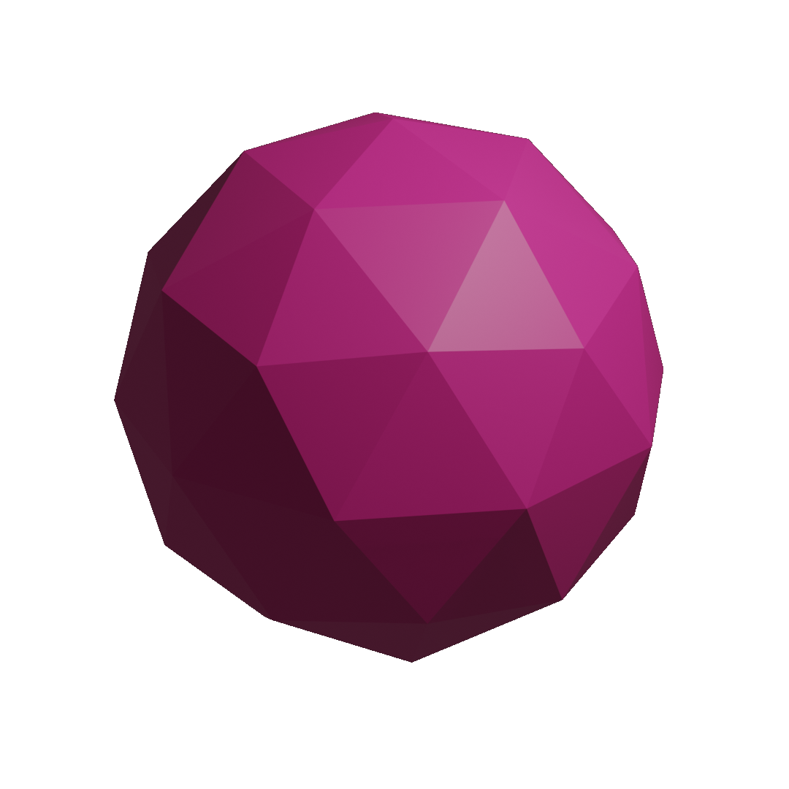

<p align="center">
  <a href="https://github.com/asc-community/AngouriMath">
    
  </a>
</p>

<h2 align="center">AngouriMath</h2>

<p align="center">
  <i>New open-source cross-platform symbolic algebra library for </i><b>C# · F# · Jupyter · C++ (WIP)</b>
  <br>
  <a href="https://am.angouri.org/quickstart/"><b>Get started</b></a>
  <b>·</b>
  <a href="#exam"><b>Examples</b></a>
  <b>·</b>
  <a href="#contrib"><b>Contributions</b></a>
  <b>·</b>
  <a href="https://am.angouri.org/whatsnew/"><b>What's new</b></a>
  <b>·</b>
  <a href="https://am.angouri.org/"><b>Website</b></a>
  <br>
  <br>
  <a href="https://dotnetfiddle.net/u901sI"></a>
  <a href="https://mybinder.org/v2/gh/asc-community/AngouriMathLab/try?filepath=HelloBook.AngouriMath.Interactive.ipynb"></a>
  <a href="https://discord.gg/YWJEX7a"></a>
</p>

<details><summary><strong>Status board</strong></summary>


#### Builds and tests
|       | Kernel/C# | F# | Interactive | C++ |
|-------|-----------|----|-------------|-----|
| Build |  |  |  |  | 
| Test  |  |  |  |  |

Note, that all tests and builds are tested for the following three operating systems: Windows, Ubuntu, Mac OS.

#### Coverage
| Kernel/C# | F# | C++ |
|-----------|----|-----|
| <a href="https://codecov.io/gh/asc-community/AngouriMath"></a> | ??? | ??? |

#### Versions
|     | Kernel/C# | F# | Interactive | C++ |
|-----|-----------|----|-------------|-----|
| Prerelease | <a href="https://www.nuget.org/packages/AngouriMath"></a> | <a href="https://www.nuget.org/packages/AngouriMath.FSharp"></a> | <a href="https://www.nuget.org/packages/AngouriMath.Interactive"></a> |  |
| Stable | <a href="https://www.nuget.org/packages/AngouriMath"></a> | <a href="https://www.nuget.org/packages/AngouriMath.FSharp"></a> | <a href="https://www.nuget.org/packages/AngouriMath.Interactive"></a> | WIP |
| Downloads | <a href="https://www.nuget.org/packages/AngouriMath"></a> | <a href="https://www.nuget.org/packages/AngouriMath.FSharp"></a> | <a href="https://www.nuget.org/packages/AngouriMath.Interactive"></a> | WIP |

There are also latest-master versions (updated on every push to master) on [MyGet](https://www.myget.org/feed/Packages/angourimath):
| MyGet | Downloads |
|-------|-----------|
| [](https://www.myget.org/feed/angourimath/package/nuget/AngouriMath) |  |
| [](https://www.myget.org/feed/angourimath/package/nuget/AngouriMath.FSharp) |  |
| [](https://www.myget.org/feed/angourimath/package/nuget/AngouriMath.Interactive) |  |
  
Source to install from MyGet:
```
https://www.myget.org/F/angourimath/api/v3/index.json  
```
  
#### Other info
| Website | Stars | License |
|---------|-------|---------|
| <a href="https://am.angouri.org"></a> |  |  |
</details>

## What is it about?

<a href="#jupyter"></a>

<a href="https://am.angouri.org">AngouriMath</a> is an open source symbolic algebra library.
That is, via AngouriMath, you can
automatically <a href="https://am.angouri.org/wiki/07.-Solvers.html">solve</a> 
equations, systems of equations, work with sets,
<a href="https://am.angouri.org/wiki/05.-Differentiation.html">differentiate</a>,
<a href="https://am.angouri.org/wiki/01.-Expressions.html">parse</a> from string,
<a href="https://am.angouri.org/wiki/09.-Compilation.html">compile expressions</a>, work
with <a href="https://am.angouri.org/wiki/10.-Matrices.html">matrices</a>, find limits,
convert an expression to LaTeX, and <a href="https://am.angouri.org/wiki/">many other things</a>.

It is not a CAS, so you can use it in any your project by installing it from 
<a href="https://www.nuget.org/packages/AngouriMath">NuGet</a>. AngouriMath
can be used in calculators, algebra systems, educational/quiz apps, graphics,
TeX rendering applications, etc.

It is free to use even in commercial projects. We work on it a lot, so your requests on 
<a href="https://github.com/asc-community/AngouriMath/issues">issues</a> are likely to
be considered within a few hours.

## Quick start
1. Install AngouriMath from [NuGet](https://www.nuget.org/packages/AngouriMath).
2. Write the following code:
```cs
using AngouriMath; using System;
Entity expr = "x + sin(y)";
Console.WriteLine(expr);
```
3. Run.

<a href="https://am.angouri.org/quickstart/"><strong>More detailed Quick Start</strong></a>.

If you are new to AM, we suggest you checking out some samples instead of reading boring 
documentation. If you want to contribute, we would be happy to welcome you in our
community.

For any questions, feel free to contact us via <a href="https://discord.gg/YWJEX7a">Discord</a>.

Official website: [am.angouri.org](https://am.angouri.org/).

<a id="exam"></a>

## Examples

Expand any section to see. Examples with live shell are on the [website](https://am.angouri.org/).

<details><summary><strong>Computations</strong></summary>

Use as a simple calculator:
```cs
Entity expr = "1 + 2 * log(3, 9)";
Console.WriteLine(expr.EvalNumerical());
```


```cs
Console.WriteLine("2 / 3 + sqrt(-16)".EvalNumerical());
>>> 2 / 3 + 4i
```


```cs
Console.WriteLine("(-2) ^ 3".EvalNumerical());
```


Build expressions with variables and substitute them:
```cs
Entity expr = "2x + sin(x) / sin(2 ^ x)";
var subs = expr.Substitute("x", 0.3m);
Console.WriteLine(subs);
```


Simplify complicated expressions:
```cs
Console.WriteLine("2x + x + 3 + (4 a * a^6) / a^3 / 5".Simplify());
```


```cs
var expr = "1/2 + sin(pi / 4) + (sin(3x)2 + cos(3x)2)";
Console.WriteLine(expr.Simplify());
```


Compiled functions work 15x+ faster
```cs
var x = MathS.Variable("x");
var expr = MathS.Sin(x) + MathS.Sqrt(x) / (MathS.Sqrt(x) + MathS.Cos(x)) + MathS.Pow(x, 3);
var func = expr.Compile(x);
Console.WriteLine(func.Substitute(3));
```

```cs
var expr = "sin(x) + sqrt(x) / (sqrt(x) + cos(x)) + x3";
var compiled = expr.Compile("x");
Console.WriteLine(compiled.Substitute(4));
```

</details>

<details><summary><strong>Algebra</strong></summary>

Start with boolean algebra:
```cs
Entity expr1 = "a and b or c";

// Those are the same
Entity expr3 = "a -> b";
Entity expr3 = "a implies b";
```

```cs
Entity expr = "a -> true";
Console.WriteLine(MathS.SolveBooleanTable(expr, "a"));
```

```
>>> Matrix[2 x 1]
>>> False
>>> True
```

Next, solve some equations:
```cs
Console.WriteLine("x^2 + x + a".SolveEquation("x"));
```


Under developing now and forever (always available)
```cs
Entity expr = "(sin(x)^2 - sin(x) + a)(b - x)((-3) * x + 2 + 3 * x ^ 2 + (x + (-3)) * x ^ 3)";
Console.WriteLine(expr.SolveEquation("x").Latexise());
```


Try some inequalities:
```cs
Console.WriteLine("(x - 6)(x + 9) >= 0".Solve("x"));
```


Systems of equations:
```cs
var system = MathS.Equations(
    "x^2 + y + a",
    "y - 0.1x + b"
);
Console.WriteLine(system);
var solutions = system.Solve("x", "y");
Console.WriteLine(solutions);
```
System:


Result:


```cs
var system = MathS.Equations(
    "cos(x2 + 1)^2 + 3y",
    "y * (-1) + 4cos(x2 + 1)"
);
Console.WriteLine(system.Latexise());
var solutions = system.Solve("x", "y");
Console.WriteLine(solutions);
```

(solution matrix is too complicated to show)

</details>

<details><summary><strong>Calculus</strong></summary>

Find derivatives:
```cs
Entity func = "x^2 + ln(cos(x) + 3) + 4x";
Entity derivative = func.Differentiate("x");
Console.WriteLine(derivative.Simplify());
```


Find limits:
```cs
WriteLine("(a x^2 + b x) / (e x - h x^2 - 3)".Limit("x", "+oo").InnerSimplified);
```


Find integrals:
```cs
WriteLine("x^2 + a x".Integrate("x").InnerSimplified);
```


</details>

<details><summary><strong>Sets</strong></summary>

There are four types of sets:
```cs
WriteLine("{ 1, 2 }".Latexise());
WriteLine("[3; +oo)".Latexise());
WriteLine("RR".Latexise());
WriteLine("{ x : x^8 + a x < 0 }".Latexise());
```


And there operators:
```cs
WriteLine(@"A \/ B".Latexise());
WriteLine(@"A /\ B".Latexise());
WriteLine(@"A \ B".Latexise());
```


</details>

<details><summary><strong>Syntax</strong></summary>

You can build LaTeX with AngouriMath:
```cs
var expr = "x ^ y + sqrt(x) + integral(sqrt(x) / a, x, 1) + derive(sqrt(x) / a, x, 1) + limit(sqrt(x) / a, x, +oo)";
Console.WriteLine(expr.Latexise());
>>> {x}^{y}+\sqrt{x}+\int \left[\frac{\sqrt{x}}{a}\right] dx+\frac{d\left[\frac{\sqrt{x}}{a}\right]}{dx}+\lim_{x\to \infty } \left[\frac{\sqrt{x}}{a}\right]
```


You can parse `Entity` from string with
```cs
var expr = MathS.FromString("x + 2 + sqrt(x)");
Entity expr = "x + 2 + sqrt(x)";
```

A few convenient features: `x2` => `x^2`, `a x` => `a * x`, `(...)2` => `(...)^2`, `2(...)` => `2 * (...)`

</details>

<details><summary><strong>Compilation</strong></summary>

Now you can compile expressions with pritimives into native lambdas. They will be
at least as fast as if you wrote them in line in code, or faster if you have
same subexpressions in your expression.

```cs
Entity expr = "a and x > 3";
var func = expr.Compile<bool, double, bool>("a", "x");
WriteLine(func(true, 6));
WriteLine(func(false, 6));
WriteLine(func(true, 2));
WriteLine(func(false, 2));
```

Output:

```
True
False
False
False
```

</details>

<details><summary><strong>F#</strong></summary>

<a href="https://www.nuget.org/packages/AngouriMath.FSharp">Download</a>

Not everything is supported directly from F#, so if something missing, you will need
to call the necessary methods from AngouriMath.

```fs
open Functions
open Operators
open Shortcuts

printfn "%O" (solutions "x" "x + 2 = 0")

printfn "%O" (simplified (solutions "x" "x^2 + 2 a x + a^2 = 0"))

printfn "%O" (``dy/dx`` "x^2 + a x")

printfn "%O" (integral "x" "x2 + e")

printfn "%O" (``lim x->0`` "sin(a x) / x")

printfn "%O" (latex "x / e + alpha + sqrt(x) + integral(y + 3, y, 1)")

```

</details>

<details><summary><strong>C++ (Experimental)</strong></summary>

At the moment, AngouriMath.CPP is in the experimental phase. See <a href="https://am.angouri.org/quickstart/#cpp">how to get AngouriMath for C++</a>.
```cpp
#include <AngouriMath.h>

int main()
{
    AngouriMath::Entity expr = "x y + 2";
    std::cout << expr.Differentiate("x");
}
```

</details>

<details><summary><strong>Jupyter</strong></summary>

If you already installed <a href="https://jupyter.org/install">Jupyter</a> and 
<a href="https://github.com/dotnet/interactive">Interactive</a> for it, install
<a href="https://www.nuget.org/packages/AngouriMath.Interactive">package</a> by copying this to your first cell:

```cs
#r "nuget:AngouriMath.Interactive, *-*"
```

Now any `ILatexiseable` will be displayed as LaTeX. Try example
<a href="https://mybinder.org/v2/gh/asc-community/Try/main?filepath=HelloBook.AngouriMath.Interactive.ipynb">here</a>, or 
<a href="https://nbviewer.jupyter.org/github/asc-community/Try/blob/main/notebooks/HelloBook.AngouriMath.Interactive.ipynb">view</a> it

Check the <a href="Sources/Samples/Interactive.Sample.ipynb">F#</a> and 
<a href="Sources/Samples/CSharp.Interactive.Sample.ipynb">C#</a> samples.

</details>

<details><summary><strong>Multithreading</strong></summary>

You are guaranteed that all functions in AM run in one thread. It is also guaranteed that you can safely run multiple 
functions from AM in different threads, that is, all static variables and lazy properties are thread-safe.

There is also support of cancellation a task. However, to avoid injecting the cancellation token argument into all methods,
we use `AsyncLocal<T>` instead. That is why instead of passing your token to all methods what you need is to pass it once
to the `MathS.Multithreading.SetLocalCancellationToken(CancellationToken)` method.

There is a sample code demonstrating cancellation:

```cs
var cancellationTokenSource = new CancellationTokenSource();

// That goes instead of passing your token to methods
MathS.Multithreading.SetLocalCancellationToken(cancellationTokenSource.Token);

// Then you normally run your task
var currTask = Task.Run(() => InputText.Text.Solve("x"), cancellationTokenSource.Token);

try
{
    await currTask;
    LabelState.Text = currTask.Result.ToString();
}
catch (OperationCanceledException)
{
    LabelState.Text = "Operation canceled";
}
```

</details>

If you want, you can add a badge to your repo:
```
[](https://am.angouri.org)
```
[](https://am.angouri.org)

## <a name="contrib"></a>Contribution

We appreciate and welcome any contributors to AngouriMath. Current tasks can be tracked
on <a href="https://github.com/asc-community/AngouriMath/projects">this page</a>.

Use pull requests to contribute to it. We also appreciate early pull requests so that we know what you are improving and
can help you with something.

Documentation for contributors and developers is <a href="./Sources/AngouriMath/Docs/Contributing/README.md">here</a>.

## <a name="license"></a>License

<a href="./LICENSE.md"></a>

The project is open source, but can be used in closed commercial projects. There is no restriction on it
with the only requirement to keep the MIT license with all distributives of AngouriMath.
