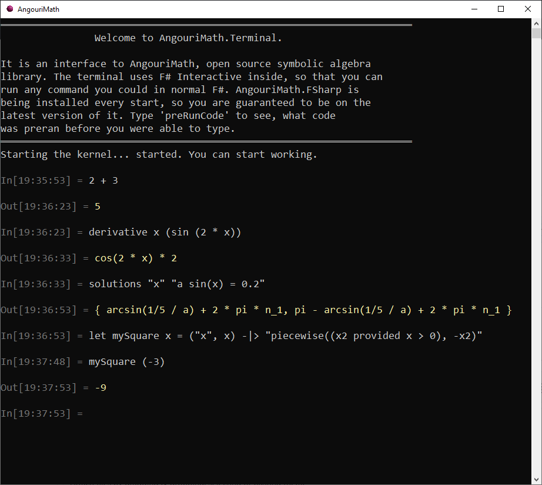

## AngouriMath.Terminal

This is desktop-targeted convenient CLI for AngouriMath. The idea is to provide convenient
easy-to-use and lightweight terminal to run some basic calculations in it.

The interface language is F#. If you're not familiar with it, check out a [Jupyter notebook](https://mybinder.org/v2/gh/asc-community/AngouriMathLab/try?filepath=HelloBook.AngouriMath.Interactive.ipynb),
an interactive graphical notebook to working with AngouriMath.

